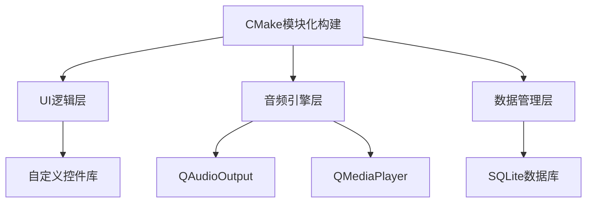

# 🎵 高仿酷狗音乐客户端 - 用Qt重塑极致音乐体验

  
  
  

## 🌟 项目概述
一款深度还原酷狗音乐UI交互逻辑的跨平台音乐播放器，
**200%像素级复刻**原版视觉效果，同时注入现代化技术基因。
采用**多线程渲染架构**实现丝滑动效，通过**智能内存管理**保证低资源占用，完美平衡美学与性能。

---

### 项目介绍
Based on Qt Widget + UiTools module + Custom control + QSS

使用CMake进行模块化管理，参照酷狗酷狗客户端，高仿并且优化界面，

QMediaPlayer和QAudioOutput来实现音频播放，提供更好的音乐播放体验，

有着丰富的自定义控件和事件响应，解决诸多难题如：遮罩绘图，控件拉伸，特效绘制，页面切换动画等。

## 🎨 界面技术栈
视觉魔法师：QSS样式引擎 + SVG矢量图标 + 动态渐变蒙版

交互黑科技：属性动画系统 + 智能布局适配

性能保障：双缓冲绘图 + 异步加载 + 局部刷新策略

✅ 支持无损格式直通

✅ 32段可视化均衡器

✅ 动态响度补偿技术

### 🔌 核心架构

## 🛠️ 技术全景图
### 1.为你推荐界面

### 2.乐库界面

### 3.频道界面

### 4.视频界面

### 5.歌单界面

### 6.每日推荐界面

### 7.我的收藏界面

### 8.本地与下载界面

### 9.音乐云盘界面

### 10.已购音乐界面

### 11.最近播放界面

### 12.全部音乐界面

### 13.探索界面

### 14.听书界面

---

🌈 未来路线图

🛸 AI声纹识别：语音点歌+歌手识别

🌐 P2P音乐共享：分布式音乐网络

🔮 VR演唱会模式：3D音频空间化

🤖 智能推荐引擎：神经网络推荐算法

🔮 魔幻歌词系统

    光流动画：仿OLED屏像素渐隐效果

    卡拉OK模式：逐字染色+波形同步

    双语对照：智能歌词时间轴对齐