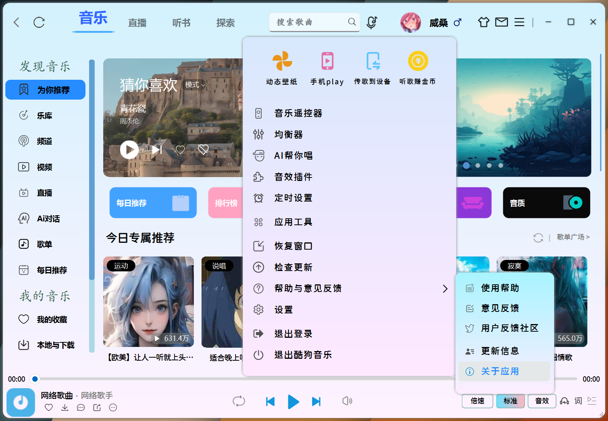
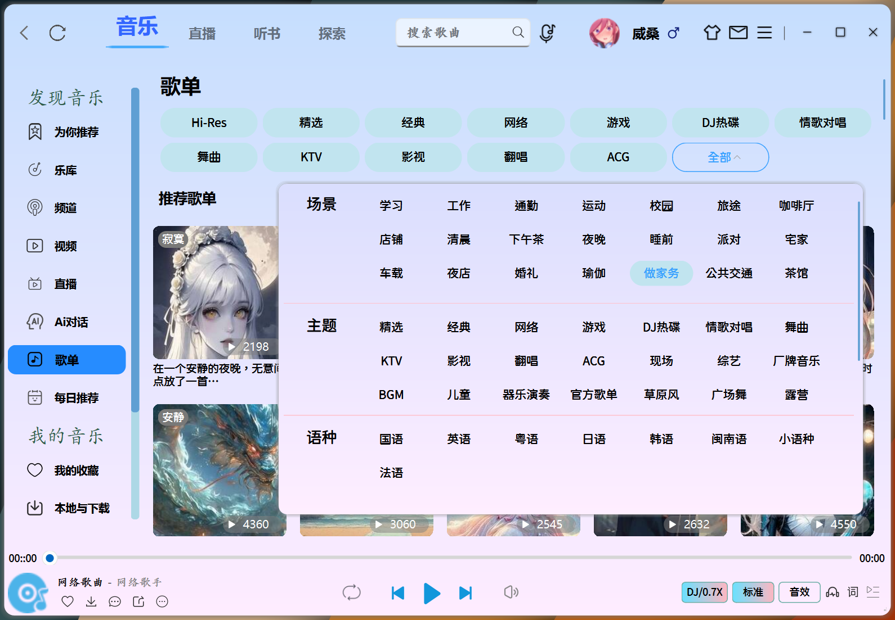
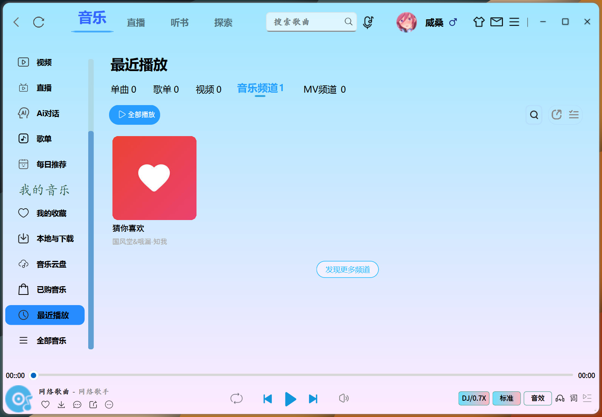
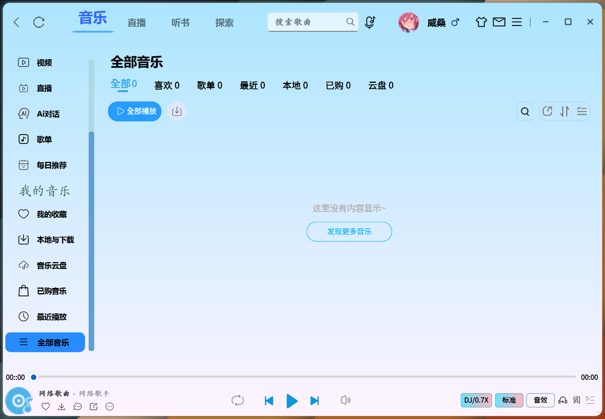
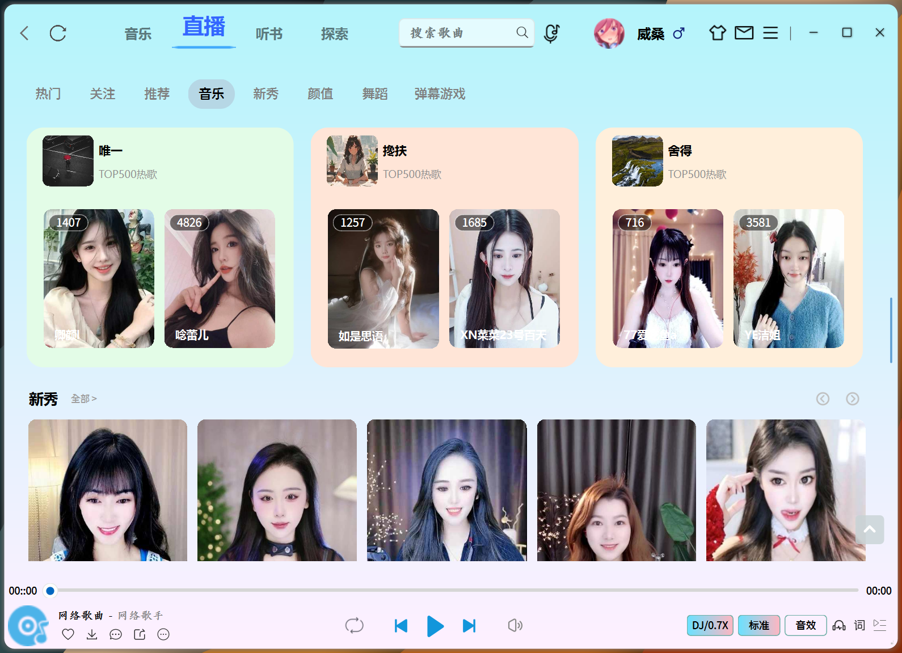

# 🎵 高仿酷狗音乐客户端 - 用Qt重塑极致音乐体验

  
  
   
  🔥
  
  

  🔥

🎁如果你喜欢该项目，请点击右上角的✨星星✨，你的 <strong>Star</strong>是我最大的动力
 
<strong>本项目代码仅限研究和学习使用，资源版权归音乐平台所有</strong>

---
### 本人开发工具用的是CLion，非常简便明了，编译的话，生成器使用Ninja，工具链请使用 **_MinGW_** , *MSVC* 虽然能编译通过，但是播放音乐有个BUG，不知道怎么回事。构建类型选择Release（建议）的话，不管构建还是运行都会快很多。

| [Ubuntu/macOS][lin-link] | [Windows][win-link] | [License][license-link] |
| :----------------------: | :-----------------: | :---------------------: |
|       ![lin-badge]       |    ![win-badge]     |    ![license-badge]     |

[lin-link]: https://你的Ubuntu/macOS构建状态链接
[win-link]: https://你的Windows构建状态链接
[license-link]: https://你的License文件链接

[lin-badge]: https://img.shields.io/badge/Ubuntu/macOS-Unknown-lightgrey?logo=linux
[win-badge]: https://img.shields.io/badge/Windows-Passing-success?logo=windows
[license-badge]: https://img.shields.io/badge/License-MIT-blue.svg

### 📚项目介绍
Based on Qt Widget + UiTools module + Custom control + QSS

使用**CMake**进行模块化管理，实现**模块解耦**（UI/播放器/网络分层），参照酷狗酷狗客户端，高仿并且优化界面，

**QMediaPlayer**和**QAudioOutput**来实现音频播放，提供更好的音乐播放体验，

采用SQLite存储音乐元数据（标题/专辑/路径），使用Qt SQL模块实现播放记录管理

通过**QNetworkAccessManager**实现在线音乐流媒体播放，采用 **QtConcurrent** + **QFutureWatcher** 实现**非阻塞式**线程任务调度
，基于 **QThreadPool** 实现 动态弹性线程池，通过 QRunnable 封装任务单元，自动回收线程资源。

有着丰富的自定义控件和事件响应，解决诸多难题如：遮罩绘图，控件拉伸，特效绘制，页面切换动画等。

## 🎨 界面技术栈
视觉魔法师：QSS样式引擎 + SVG矢量图标 + 动态渐变蒙版

交互黑科技：属性动画系统 + 智能布局适配

性能保障：双缓冲绘图 + 异步加载 + 局部刷新策略

✅ 支持无损格式直通

✅ 32段可视化均衡器

✅ 动态响度补偿技术

### 🔌 核心架构

## 🛠️ 技术全景图
### 1.为你推荐界面

### 2.乐库界面

### 3.频道界面

### 4.视频界面

### 5.歌单界面

### 6.每日推荐界面

### 7.我的收藏界面

### 8.本地与下载界面

### 9.音乐云盘界面

### 10.已购音乐界面

### 11.最近播放界面

### 12.全部音乐界面

### 13.探索界面

### 14.听书界面

### 15.直播界面

---

🌈 未来路线图

🛸 AI声纹识别：语音点歌+歌手识别

🌐 P2P音乐共享：分布式音乐网络

🔮 VR演唱会模式：3D音频空间化

🤖 智能推荐引擎：神经网络推荐算法

🔮 魔幻歌词系统

    光流动画：仿OLED屏像素渐隐效果
    
    卡拉OK模式：逐字染色+波形同步
    
    双语对照：智能歌词时间轴对齐

---
## 😊打赏

### 觉得分享的内容还不错, 就请作者喝杯奶茶吧~~