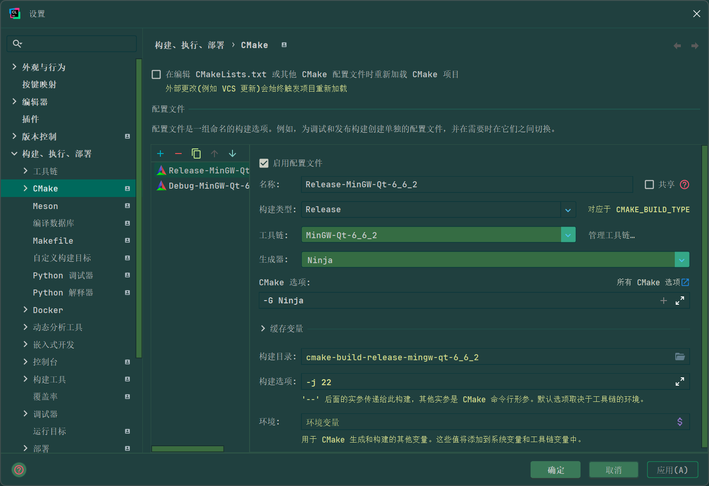
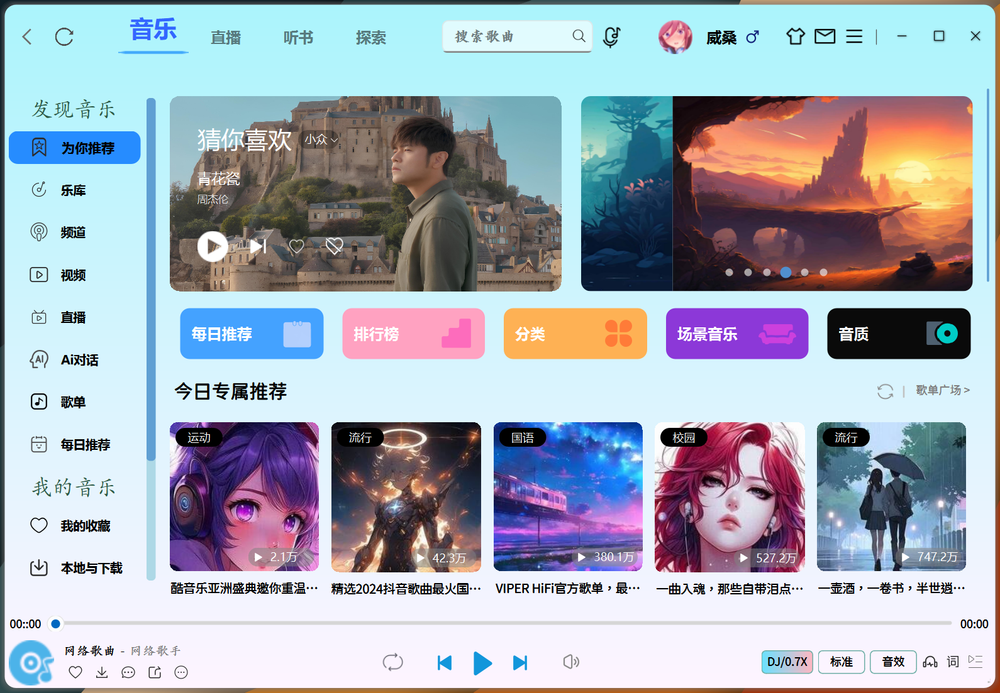
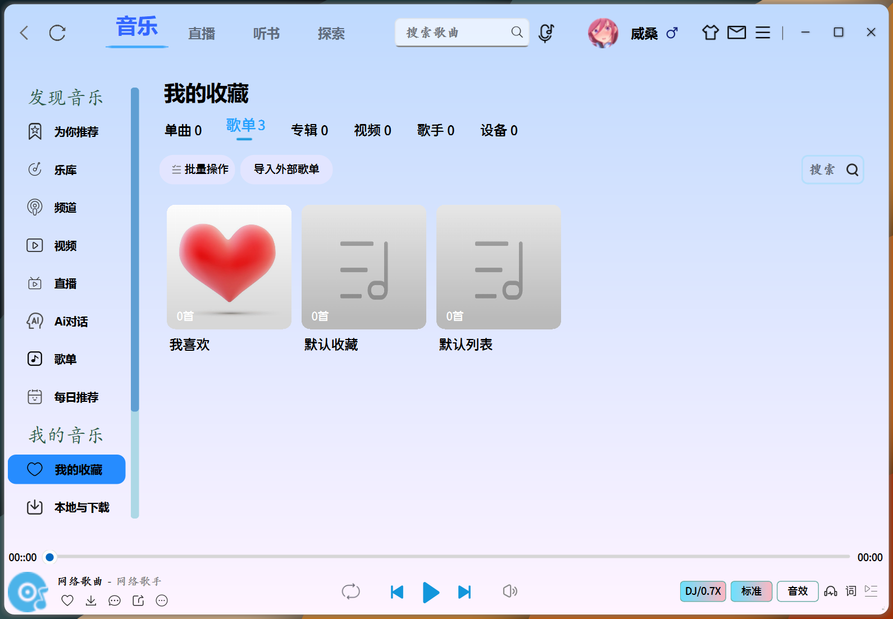
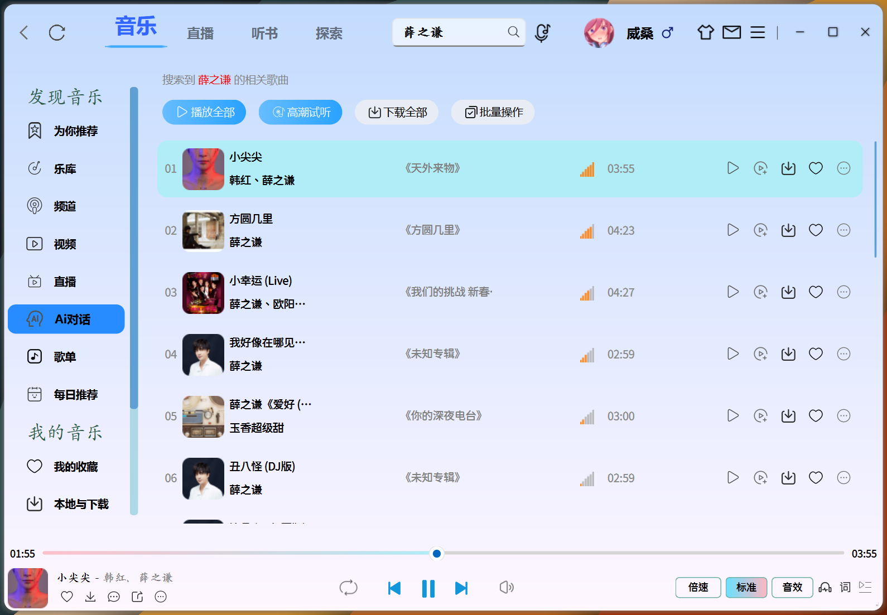

# 🎵 高仿酷狗音乐客户端 - 用Qt重塑极致音乐体验😌

<p align="center">
  
  
  
  <br>
  <span>🔥</span>
  
  

  <span>🔥</span>
</p>

<p align="center">
🎁如果你喜欢该项目，请点击右上角的✨星星✨，你的 <strong>Star</strong> 是我最大的动力
<br>
<strong>本项目代码仅限研究和学习使用，资源版权归音乐平台所有</strong>
</p>

---
### 本人开发工具用的是CLion，非常简便明了，编译的话，生成器使用Ninja，工具链请使用 **_MinGW_** , 不要用VS2022(MSVC)。构建类型选择Release（建议）的话，不管构建还是运行都会快很多，分支的话Windows 10/11用户可以选择Stable稳定版，master分支一直在开发中，能用是能用，但不保证稳定😜。


Ubuntu 下如果报错：
```
/home/weiwang/Desktop/KuGou/tools/ccache/ccache: error while loading shared libraries: libhiredis.so.0.14: cannot open shared object file: No such file or directory
```
请执行以下命令：
```
sudo apt install ccache
rm YourProjectPath/KuGou/tools/ccache/ccache
cp /usr/bin/ccache YourProjectPath/KuGou/tools/ccache
```
#### 同时，Ubuntu 下编译虽然能通过且能运行，但是对于鼠标事件的接受和样式渲染有问题，精力有限，不会去维护。。。

### Ai对话功能需要预先获取API，有问题请参考：https://gitee.com/a-mo-xi-wei/qt6-access-deepseek#qt6-%E6%8E%A5%E5%85%A5deepseek

| [Ubuntu/macOS][lin-link] | [Windows][win-link] | [License][license-link] |
| :----------------------: | :-----------------: | :---------------------: |
|       ![lin-badge]       |    ![win-badge]     |    ![license-badge]     |

[lin-link]: https://你的Ubuntu/macOS构建状态链接
[win-link]: https://你的Windows构建状态链接
[license-link]: https://你的License文件链接

[lin-badge]: https://img.shields.io/badge/Ubuntu/macOS-Passing-lightgrey?logo=linux
[win-badge]: https://img.shields.io/badge/Windows-Passing-success?logo=windows
[license-badge]: https://img.shields.io/badge/License-MIT-blue.svg

### 📚项目介绍
Based on Qt Widget + UiTools module + Custom control + QSS + QsLog + Custom **Spdlog** + **JWT** + **FFmpeg** + **SDL**

使用**CMake**进行模块化管理，确保核心组件（如用户界面、媒体播放器和网络层）的**高度解耦**，参照酷狗客户端，高仿并且优化界面，

应用程序现采用 **FFmpeg** 和 **SDL** 进行音频解码与播放来实现音频播放，从而提供更灵活、更强大的音乐播放体验。

集成 **QsLog** 和自定义 **Spdlog** 实现健壮的日志系统，使用 JWT 确保安全的用户认证。采用**SQLite**存储音乐元数据（标题/专辑/路径），使用Qt SQL模块实现播放记录管理

通过 **QNetworkAccessManager** 实现在线音乐流媒体播放，结合 QtConcurrent 和 QFutureWatcher 实现非阻塞线程任务调度，基于 **QThreadPool** 构建动态弹性线程池，通过 QRunnable 封装任务单元，实现线程资源的自动回收。

项目难点：播放列表、搜索功能、菜单功能，歌词显示、播放控制等**播放器核心功能**设计问题，自定义控件和事件响应，遮罩绘图，控件拉伸，**特效绘制**，
复杂业务逻辑问题，登录注册、**Ai对话**、**数据库连接池**设计、**异步非阻塞式线程**设计、**日志系统**设计、**网络模块**设计、**开源库**（如 FFmpeg 和 SDL）的集成与优化，以提升媒体播放能力。

## 🎨 界面技术栈
视觉魔法师：QSS样式引擎 + SVG矢量图标 + 动态渐变蒙版

交互黑科技：属性动画系统 + 智能布局适配

性能保障：双缓冲绘图 + 异步加载 + 局部刷新策略

✅ 支持无损格式直通

✅ 32段可视化均衡器

✅ 动态响度补偿技术

### 🔌 核心架构
```mermaid
flowchart TD
%% 模块定义
    subgraph 构建系统
        CMakeModule["CMake模块化构建"]
    end

    subgraph 表现层
        UILogic["UI逻辑层"]
        CustomWidgets["自定义控件库"]
    end

    subgraph 核心逻辑层
        CoreCode["核心代码层"]
        KuGouClient["KuGouClient"]
        KuGouServer["KuGouServer"]
    end

    subgraph 第三方依赖层
        ThirdParty["第三方管理层"]
        PoolAsyncNetwork["池化 异步 网络"]
    end

%% 连接关系
    CMakeModule -->|"数据/控制流"| UILogic
    CMakeModule -->|"数据/控制流"| CoreCode
    CMakeModule -->|"数据/控制流"| ThirdParty

    UILogic -->|"调用/交互"| CustomWidgets
    CoreCode -->|"业务逻辑调用"| KuGouClient
    CoreCode -->|"业务逻辑调用"| KuGouServer

    ThirdParty -->|"封装/使用"| PoolAsyncNetwork

    CustomWidgets -- UI事件回传 --> UILogic
    KuGouClient -- 网络请求 --> PoolAsyncNetwork
    KuGouServer -- 网络请求 --> PoolAsyncNetwork

```

<!-- ] -->

## 🛠️ 技术全景图
### 1.为你推荐界面



### 2.乐库界面


### 3.频道界面

### 4.视频界面


### 5.Ai对话界面(略卡😅)


### 6.歌单界面

### 7.每日推荐界面


### 8.我的收藏界面


### 9.本地与下载界面


### 10.音乐云盘界面


### 11.已购音乐界面

### 12.最近播放界面


### 13.全部音乐界面

### 14.探索界面

### 15.听书界面


### 16.直播界面


---

🌈 未来路线图

🛸 AI声纹识别：语音点歌+歌手识别

🌐 P2P音乐共享：分布式音乐网络

🔮 VR演唱会模式：3D音频空间化

🤖 智能推荐引擎：神经网络推荐算法

🔮 魔幻歌词系统

    光流动画：仿OLED屏像素渐隐效果
    
    卡拉OK模式：逐字染色+波形同步
    
    双语对照：智能歌词时间轴对齐


---
## 😊打赏

### 若文章有所感所获，亦可请我共饮一杯肥宅冰阔落~~